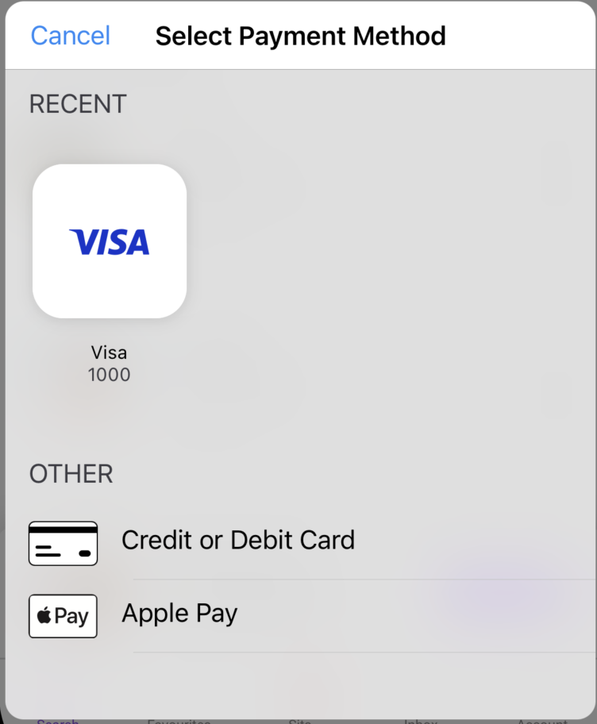

# expo-braintree-drop-in

Expo integration for Braintree DropIn UI.
Its implementation utilises [3D Secure](https://developer.paypal.com/braintree/docs/guides/3d-secure/overview) transactions.

Currently supported payment methods are:

- Credit cards
- ApplePay
- GooglePay



## Installation

### Requirements

You must have an existing Expo project (>= 50.0)

### Terminal

```
npm install @joinbubble/expo-braintree-drop-in
```

## Configuration

### Environment variables

Create an environment variable called `BRAINTREE_MERCHANT_ID`. (You do not need the prefix `EXPO_PUBLIC`)
Use this variable to set your [merchantId](https://developer.paypal.com/braintree/articles/control-panel/important-gateway-credentials#merchant-id) based on your environment.

_**IMPORTANT: Use a merchant id containing `sandbox` for your test environments for GooglePay to initialise with `TEST`.**_

ex `eas.json`:

```json
{
  "build": {
    "development": {
      "env": {
        "BRAINTREE_MERCHANT_ID": "merchant.com.my_org.payment.sandbox"
      }
    },
    "production": {
      "env": {
        "BRAINTREE_MERCHANT_ID": "merchant.com.my_org.payment"
      }
    }
  }
}
```

Then declare `expo-braintree-drop-in` in `app.config.js`

```js
// app.config.js

// add to the exported config
plugins: [
  // ...,
  [
    "@joinbubble/expo-braintree-drop-in",
    { braintreeMerchantId: process.env.BRAINTREE_MERCHANT_ID },
  ],
];
```

## Usage

<h3>Display the Drop-In</h3>

In this integration, we assume that you can already generate and fetch a [client token](https://developer.paypal.com/braintree/docs/start/hello-client/javascript/v3/#get-a-client-token)

```jsx
// CheckoutButton.tsx
import * as ExpoBraintreeDropIn from "@bubble/braintree-drop-in";

function CheckoutButton() {
  const [clientToken, setClientToken] = useState();

  useEffect(() => {
    (async () => {
      const res = await fecthClientToken();
      setClientToken(res.token);
    })();
  }, []);

  if (!clientToken) {
    return null;
  }

  return (
    <Button
      title="Show Braintree Drop-In"
      onPress={async () => {
        const payload = {
          givenName: "Jill",
          surname: "Doe",
          streetAddress: "555 Smith St",
          locality: "London",
          postalCode: "A1 1AB",
          email: "test@example.com",
          amount: 1.0,
        };

        const result = await ExpoBraintreeDropIn.showDropIn(
          payload,
          clientToken
        );

        console.log({ result });
      }}
    />
  );
}
```

`result` is a string that represents the [payment nonce](https://developer.paypal.com/braintree/docs/start/hello-server/node#receive-a-payment-method-nonce-from-your-client) that you can send back to your server

<h3>Verify a vaulted card</h3>

If you need to perfom a [verification](https://developer.paypal.com/braintree/docs/guides/3d-secure/client-side/android/v4#verify-a-vaulted-credit-card) on a vaulted card, use the verify method.

```jsx
// CheckoutButton.tsx
import * as ExpoBraintreeDropIn from "@bubble/braintree-drop-in";

function CheckoutButton() {
  const [clientToken, setClientToken] = useState();
  const [cardToVerify, setCardToVerify] = useState();

  useEffect(() => {
    (async () => {
      const res = await fecthClientToken();
      const res2 = await fecthClientToken();

      setClientToken(res.token);
      setCardToVerify(res2.nonce);
    })();
  }, []);

  if (!clientToken) {
    return null;
  }

  return (
    <Button
      title="Verify a card via 3D Secure"
      onPress={async () => {
        const payload = {
          givenName: "Jill",
          surname: "Doe",
          streetAddress: "555 Smith St",
          locality: "London",
          postalCode: "A1 1AB",
          email: "test@example.com",
          amount: 1.0,
          // Add the nonce of the card that needs verification
          nonce: cardToVerify,
        };

        // Contact verify instead of showDropIn
        const result = await ExpoBraintreeDropIn.verify(payload, clientToken);

        console.log({ result });
      }}
    />
  );
}
```

`result` is also a string that represents the nonce that can be returned to your server.

## References

- [Braintree DropIn (IOS)](https://braintree.github.io/braintree-ios-drop-in/current/)
- [Braintree DropIn (Android)](https://developer.paypal.com/braintree/docs/start/hello-client/android/v4)
- [Expo Native Module](https://docs.expo.dev/modules/native-module-tutorial/)
